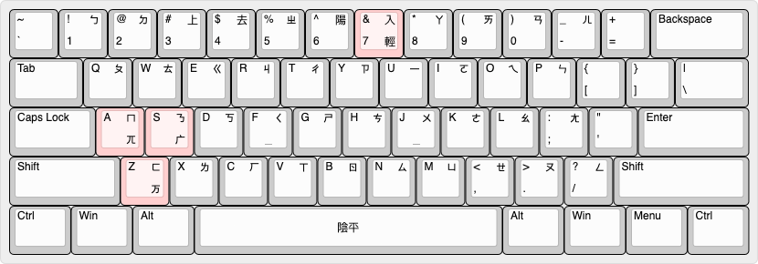
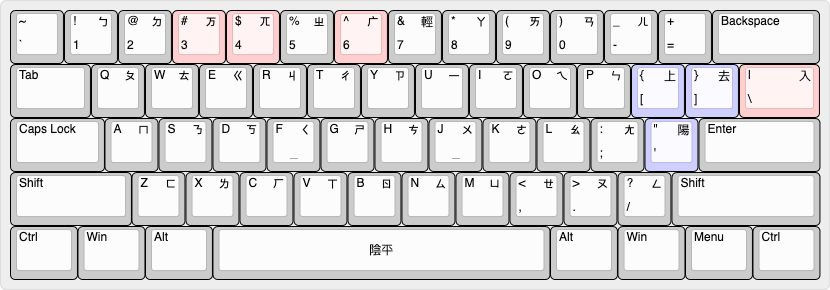
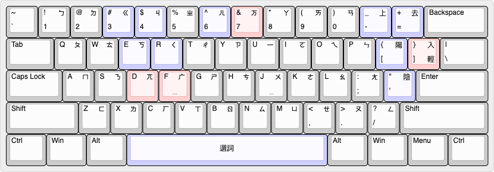
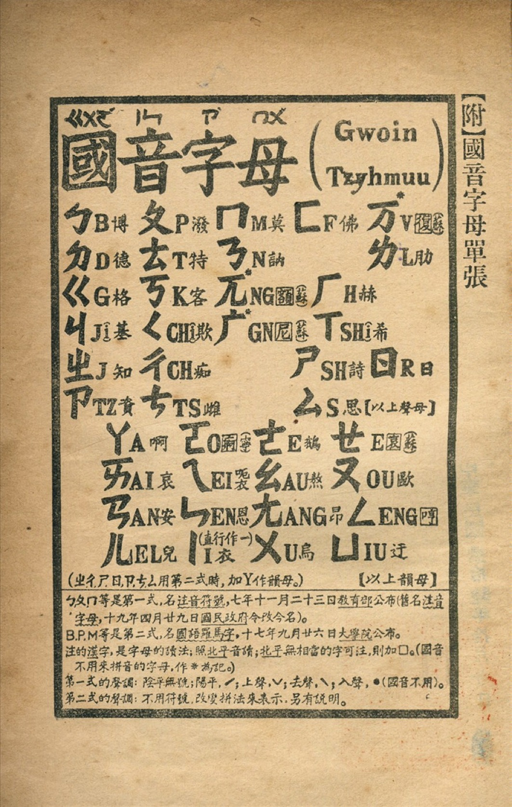

# rime-bepemefeve

以注音字母記錄的「老國音」字音表，可通過RIME輸入法引擎支援多種漢字輸入方案。

以1926年的第三十八版《校改國音字典》爲主要參考，兼收《學生字典》（陸爾奎、方毅，1915）與《國音新詩韻》（趙元任，1922），每條字音均附有出處。

*注音格式：使用聲調符號表示聲調（不使用四聲點法），在字頭加上`·`表示輕音。可能同時寫出原聲調，例如「子」`·ㄗˇ`*

### 目前支援的輸入方案
- [注音 大千兼容式](#5jup)
  -  `./bepemefeve_5jup.schema.yaml`
- [注音 大千式改](#5jup_mod)
  -  `./bepemefeve_5jup_mod.schema.yaml`
- [注音 類大千式](#5jup)
  -  `./bepemefeve_5jup_like.schema.yaml`
- [國語羅馬字](#romatzyh)
  - `./bepemefeve_gr.schema.yaml`
  - `./bepemefeve_gr_atonal.schema.yaml`
  - `./guoqlo.schema.yaml`
- [趙拼](#zhauping)
  - `./bepemefeve_zhauping.schema.yaml`
- [iac轉寫](#iac)
  - `./bepemefeve_iac_im.schema.yaml`
  - `./bepemefeve_iac_lt.schema.yaml`
- [國音用漢語拼音](#tsinglou)
  - `./bepemefeve_huenhoshi.schema.yaml`

## 基於注音字母的輸入方案

### 大千兼容式
不增加按鍵，兼容現有大千式軟鍵盤：
- 合併按鍵：ㄪ/ㄫ/ㄬ <-> ㄒ/ㄑ/ㄖ <-> `V`/`F`/`B`鍵
- 輕聲鍵（數字鍵7）同時兼任入聲鍵：標在字頭爲輕音，標在字尾爲入聲

\
*「大千兼容式」鍵盤排列（高亮的按鍵不同於標準「大千式」）*

配方位置：`./bepemefeve_5jup.schema.yaml`\
碼表位置：`./bepemefeve.dict.yaml`

### 大千式改
鍵盤排列除了聲調部分，與「大千式」完全一致。

具體是在「大千式」的基礎上作了以下修改：
- `3`、`4`、`6`鍵（原`ˇ`上聲、`ˋ`去聲、`ˊ`陽平）用作輸入ㄪ、ㄫ、ㄬ
- `'`、`[`、`]`、`\`用作輸入 陽平、上、去、入 四聲，陰平聲仍用空格鍵
- 輕音現在亦可以標在字頭

\
*「大千式改」鍵盤排列（高亮的按鍵不同於標準「大千式」）*

配方位置：`./bepemefeve_5jup_mod.schema.yaml`\
碼表位置：`./bepemefeve.dict.yaml`

### 類大千式
鍵盤根據1920年的舊注音字母表順序（ㄪ、ㄦ兩母除外）重新排列：

    1QAZ ㄅㄆㄇㄈ
    2WSX ㄉㄊㄋㄌ
    3EDC ㄍㄎㄫㄏ
    4RFV ㄐㄑㄬㄒ
    5TGB ㄓㄔㄕㄖ
    6YHN ㄗㄘㄙㄦ /* 「ㄦ」跟「ㄖ」在各種拼音方案中經常會共用同字母R，所以放在相鄰位置 */
    7UJM ㄧㄨㄩㄪ /* 「ㄪ」雖然不算介母，但只與「ㄟ」相拼，與「ㄨ」有關，所以放在同一列 */
    8IK, ㄚㄛㄜㄝ
    9OL. ㄞㄟㄠㄡ
    0P;/ ㄢㄣㄤㄥ
    /* ㄪ、ㄦ兩母不依照字母表順序排列 */

    '[-=] 陰陽上去入 /* 按鍵位置如「四聲點法」*/
    /* 陰平聲與輕音共用按鍵`'`，標在字尾爲陰平聲，標在字頭爲輕音 */

\
*「類大千式」鍵盤排列（高亮的按鍵不同於標準「大千式」）*

不同於通常的注音輸入法，本輸入方案以【空格鍵】或 `QWERTYUIOP` 選詞，以`]`和`\`鍵換頁，
而【回車鍵】用於直接輸入拉丁字母、數字等ASCII字符（毋須切換模式）

配方位置：`./bepemefeve_5jup_like.schema.yaml`\
碼表位置：`./bepemefeve.dict.yaml`

## 羅馬拼音形式的輸入方案

### 國語羅馬字（Gwoyeu Romatzyh）
*別名：國音字母第二式 (1928~)、譯音符號 (1940~)*

輸入法說明：
- 以`x`鍵 或 大寫`E`鍵 輸入`è`（ㄝ）
- 以`q`鍵 輸入 `·`（輕聲）
- `tz`可簡作`z`
  - 因爲`z`字母在G.R.中僅用於拼寫`tz`聲母
  - 上屏爲`ᵗz`
- `ch`可簡作`c`
  - 因爲`c`字母在G.R.中僅用於拼寫`ch`聲母
  - 上屏爲`cʰ`

配方位置：`./bepemefeve_gr.schema.yaml`\
碼表位置：`./bepemefeve.dict.yaml`

**獨立碼表版本：**\
配方位置：`./guoqlo.schema.yaml`\
碼表位置：`./guoqlo.dict.yaml`

**忽略聲調拼寫規則的簡易版本：**\
*＊需要時可以在字尾以數字鍵`6`, `7`, `8`, `9`, `0`標示五聲*\
配方位置：`./bepemefeve_gr_atonal.schema.yaml`\
碼表位置：`./bepemefeve.dict.yaml`

### 當代原創老國音拼音方案
-----

#### 勝爲士：趙音拼音（趙拼）
*全稱：老國音趙音拼音*

拼音方案詳見 [維基學院：老國音趙音拼音方案](https://zh.wikiversity.org/wiki/原創老國音拼音方案/老國音趙音拼音方案)

輸入法說明：
- 分別以數字鍵`6`、`7`、`8`、`9`、`0`輸入聲調：`1`(陰)、`2`(陽)、`3`(上)、`4`(去)、`5`(入)

配方位置：`./bepemefeve_zhauping.schema.yaml`\
碼表位置：`./bepemefeve.dict.yaml`

#### iacobvs：iac轉寫
拼音方案詳見：
* [維基學院：iac轉寫](https://zh.wikiversity.org/wiki/原創老國音拼音方案/iac轉寫)
* [知乎：iac老國音輸入方案](https://zhuanlan.zhihu.com/p/21674298)

輸入法說明：
- 分別以數字鍵`7`、`8`、`9`、`0`輸入聲調：`1`(陰)、`2`(陽)、`3`(上)、`4`(去)
- 入聲用`-q`

特用於輸入法的簡寫形式\
配方位置：`./bepemefeve_iac_im.schema.yaml`\
碼表位置：`./bepemefeve.dict.yaml`

與注音符號一一對應的形式\
配方位置：`./bepemefeve_iac_lt.schema.yaml`\
碼表位置：`./bepemefeve.dict.yaml`

#### 綺檐淸露：國音用漢語拼音
*別名：混合式拼音*

拼音方案詳見 [維基學院：國音用漢語拼音](https://zh.wikiversity.org/wiki/原創老國音拼音方案/國音用漢語拼音)

輸入法說明：
- 分別以數字鍵`6`、`7`、`8`、`9`、`0`輸入聲調：`1`(陰)、`2`(陽)、`3`(上)、`4`(去)、`5`(入)
- 以 `+`鍵（⇧`=`）輸入 符號`+`（表示輕音）

配方位置：`./bepemefeve_huenhoshi.schema.yaml`\
碼表位置：`./bepemefeve.dict.yaml`

